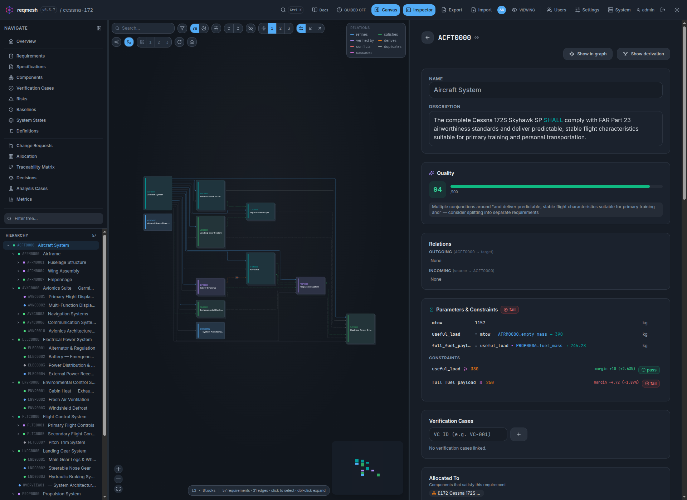
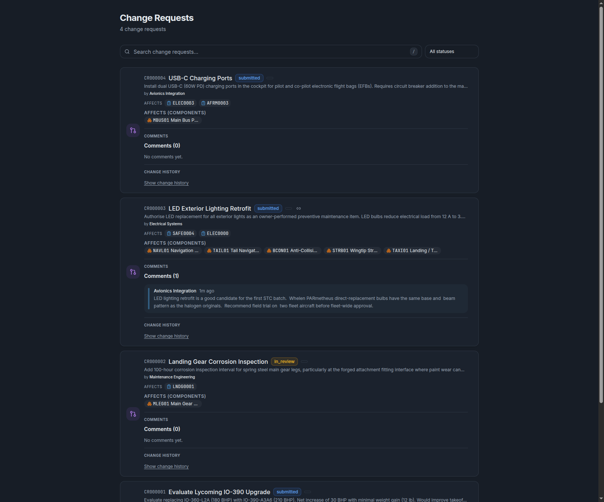
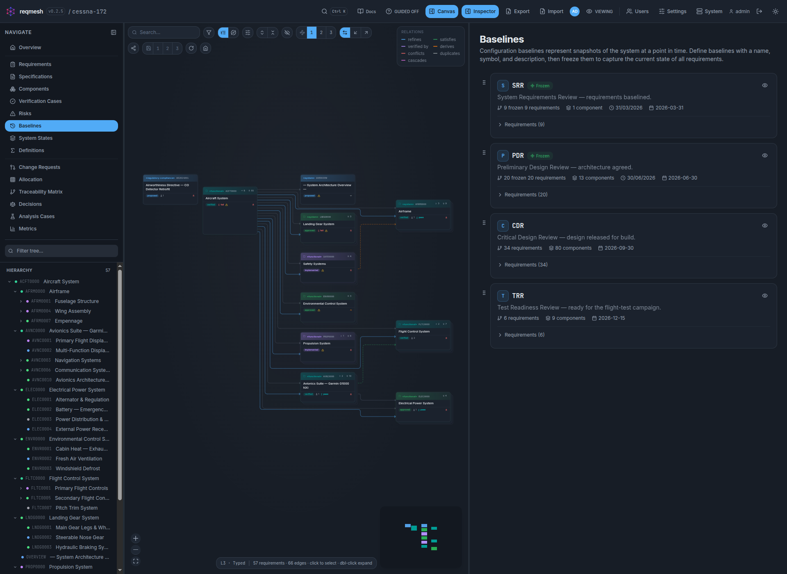
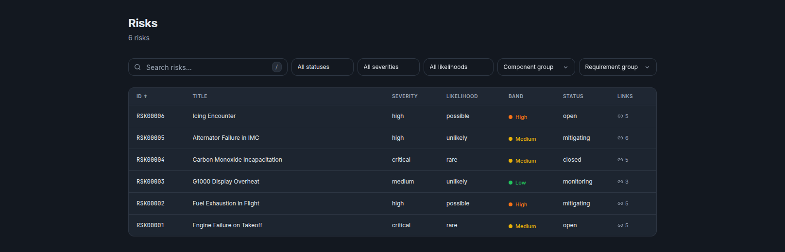
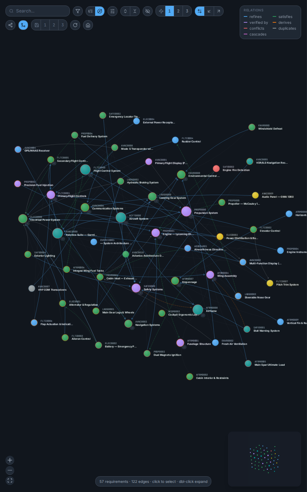

# reqmesh

<p align="center">
  
</p>



**reqmesh** is an open-source requirements management tool for engineering
teams, built for the gap between two extremes. At one end, requirements live in
a spreadsheet or a wiki page — easy to start, but nothing checks them, nothing
links them, and nobody knows what changed. At the other, a full SysML model
captures everything — and demands a modelling language, a tool licence and a
modelling discipline before the first requirement is written.

reqmesh sits between them. Every requirement, component, test and decision is
one human-readable YAML file in a git repository — no database, no binary
blobs — so the barrier to entry is a text editor and `git init`. On top of
that you get the parts of SysML that pay for themselves — a design tree
mapped onto the requirements it satisfies, parameters and constraints that
are evaluated rather than merely stated, and traceability that is checked — in
plain language, without having to learn a modelling language to use them.

- **Git-native** — one YAML file per entity, auto-committed on every change, with an optional push to a remote and a field-level audit trail.
- **Computable** — requirements carry typed parameters and constraints; verdicts, margins and budget rollups are evaluated live, and a what-if preview shows a change's blast radius before anything is written.
- **Traceable** — shallow and deep coverage, suspect-link detection, code-to-requirement tag scanning, and an allocation matrix from requirements to the components, verification cases, risks and baselines that carry them.
- **Controlled** — fingerprint-based review that invalidates itself when content changes, change requests with redlines, ordered and dated baselines with freeze/diff, and a risk matrix tuned per project.
- **Interoperable** — ReqIF 1.2, SysML v2, CSV, TSV and XLSX round-trip; scoped HTML, PDF, Markdown and LaTeX publishing.
- **Collaborative** — live updates and a presence roster over SSE, per-project permissions, and inline writing feedback drawn from INCOSE, EARS and ISO 29148.

The screenshots are the bundled **Cessna 172S Skyhawk SP** example project,
which seeds on first run.

## Get started

One command deploys a server (Docker or bare metal, reverse proxy, TLS, secrets
and a systemd unit — it asks, or takes environment variables):

```bash
curl -fsSL https://raw.githubusercontent.com/CallumNunesVaz/reqmesh/v0.6.1/scripts/install.sh | bash
```

From a checkout, for local use:

```bash
./start.sh            # web app — backend on :8000, UI on http://localhost:5173
./start.sh desktop    # native desktop app (Electron)
```

Or with Docker:

```bash
export RT_SECRET=$(openssl rand -hex 32)
export RT_ADMIN_PASSWORD=$(openssl rand -base64 16)
docker compose -f docker-compose.prod.yml up -d
```

The first launch creates an `admin` account and seeds the example project.

## A tour

<table>
  <tr>
    <td width="50%"><br><sub><b>Requirements.</b> Tree, graph canvas and inspector side by side; status, priority and verification state visible without opening anything.</sub></td>
    <td width="50%"><br><sub><b>Overview &amp; Metrics.</b> Coverage, gaps, quality scores, the risk profile and a stacked activity chart drawn from the audit history.</sub></td>
  </tr>
  <tr>
    <td width="50%"><br><sub><b>Traceability Matrix.</b> Every link in the project, filterable, with orphans and suspect links surfaced rather than hidden.</sub></td>
    <td width="50%"><br><sub><b>Allocation.</b> Requirements against components, verification cases, risks or baselines; click a cell to allocate.</sub></td>
  </tr>
  <tr>
    <td width="50%"><br><sub><b>Verification Cases.</b> Procedure, steps and measured results, which feed straight back into the parametric verdicts.</sub></td>
    <td width="50%"><br><sub><b>Change Requests.</b> Before/after redlines; a request can propose new requirements, and one whose target has moved on is refused rather than overwriting unseen edits.</sub></td>
  </tr>
  <tr>
    <td width="50%"><br><sub><b>Baselines.</b> Ordered, dated milestones with freeze and diff; membership is curated per requirement and component.</sub></td>
    <td width="50%"><br><sub><b>Decisions.</b> Architecture decision records — context, decision, rationale and consequences kept apart — linked to the requirements they govern and the components they settle.</sub></td>
  </tr>
  <tr>
    <td width="50%"><br><sub><b>Risks.</b> A severity × likelihood matrix re-tunable per project, with threatens / mitigated-by links to requirements.</sub></td>
    <td width="50%"><br><sub><b>Definitions.</b> Reusable SysML v2-style <code>constraint def</code> and <code>calc def</code>, bound by name from any requirement; <b>Analysis Cases</b> scope what-if studies over them, and <b>System States</b> say when a requirement holds.</sub></td>
  </tr>
  <tr>
    <td width="50%"><br><sub><b>The graph, as blocks.</b> Requirements, <b>Components</b> and <b>Specifications</b> laid out as a UML block diagram, collapsible by level, with derivation highlighting, saved views and a live what-if cascade lighting up the nodes whose verdict changes.</sub></td>
    <td width="50%"><br><sub><b>The graph, force-directed.</b> The same 57 requirements and 122 relations as a physics layout: clusters fall out of the link structure, and selecting a node lights up its neighbourhood to one, two or three hops.</sub></td>
  </tr>
  <tr>
    <td width="50%"><br><sub><b>Parametrics.</b> Typed parameters, constraints over them, and design vs measured verdicts with signed margins.</sub></td>
    <td width="50%"><br><sub><b>Git.</b> Initialise, push, hooks and the remote from project settings; a failed push is the loudest thing on the panel.</sub></td>
  </tr>
</table>

## Documentation

| | |
|---|---|
| **[Technical guide](docs/TECHNICAL.md)** | Architecture, running from source, tests, auth and permissions, every page in depth, the data format, the CLI |
| **[Deployment](DEPLOYMENT.md)** | Production installs: TLS, proxy, email, git push, offline mode, and every `RT_*` setting |
| **[API reference](docs/api.md)** | Every route, generated from the OpenAPI schema and checked in CI |
| **[Security](SECURITY.md)** | Posture, profiles, reporting a vulnerability |
| **[Changelog](CHANGELOG.md)** | What changed in each release — also shown in the in-app updater |

## Acknowledgements

reqmesh stands entirely on open source. On the backend:
[FastAPI](https://fastapi.tiangolo.com/), [Starlette](https://www.starlette.io/),
[Uvicorn](https://www.uvicorn.org/), [Pydantic](https://docs.pydantic.dev/),
[ruamel.yaml](https://yaml.readthedocs.io/), [PyJWT](https://pyjwt.readthedocs.io/),
[bcrypt](https://github.com/pyca/bcrypt), [WeasyPrint](https://weasyprint.org/),
[Jinja2](https://jinja.palletsprojects.com/), [openpyxl](https://openpyxl.readthedocs.io/)
and [Click](https://click.palletsprojects.com/). On the frontend:
[React](https://react.dev/), [React Router](https://reactrouter.com/),
[Vite](https://vitejs.dev/), [TypeScript](https://www.typescriptlang.org/),
[Tailwind CSS](https://tailwindcss.com/), [Zustand](https://github.com/pmndrs/zustand),
[React Flow](https://reactflow.dev/) with [elkjs](https://github.com/kieler/elkjs)
and [d3-force](https://github.com/d3/d3-force), [TipTap](https://tiptap.dev/) on
[ProseMirror](https://prosemirror.net/), [Recharts](https://recharts.org/),
[Framer Motion](https://www.framer.com/motion/), [Lucide](https://lucide.dev/),
and the [Inter](https://rsms.me/inter/) and
[JetBrains Mono](https://www.jetbrains.com/lp/mono/) typefaces. Tested with
[Playwright](https://playwright.dev/), [Vitest](https://vitest.dev/) and
[pytest](https://pytest.org/); linted by [Ruff](https://docs.astral.sh/ruff/)
and [oxlint](https://oxc.rs/). PDF reports can use the
[Tectonic](https://tectonic-typesetting.github.io/) LaTeX engine.

Bundled and adjacent third-party software is listed in
[THIRD_PARTY_NOTICES.md](THIRD_PARTY_NOTICES.md).

## License

reqmesh is licensed under the **GNU General Public License v3.0 or later**
(GPL-3.0-or-later) — see [LICENSE](LICENSE). GPLv3 is required for compatibility
with the project's dependencies: elkjs is offered under `GPL-3.0-or-later`, and
the Apache-2.0 components (bcrypt, python-multipart) are GPLv3-compatible but not
GPLv2-compatible.
