# reqmesh

<p align="center">
  
</p>

An open-source, web-based requirements management tool with:

- **Git-native storage** — every entity is one human-readable YAML file; no databases or binary artifacts in your project directory
- **Version control native** — each project is a self-contained directory; auto-committed to git on every change, with optional push to a remote
- **Full audit trail** — field-level change history for requirements, components, specifications, and verification cases
- **Standards interchange** — import/export ReqIF 1.2, SysML v2, CSV, TSV, and XLSX (round-trips through all formats)
- **Real-time collaboration** — live change streaming over SSE with a presence roster of who's viewing each project
- **Design/function split** — components (the synthesised design) mapped onto the requirements they satisfy, with hierarchical budget rollups
- **SysML-style parametrics** — typed parameters, evaluable constraints, measured verdicts, margin computation — no SysML knowledge required
- **Live what-if preview** — try a new parameter value and watch the recalculation propagate through downstream requirements, animated in the inspector and highlighted live on the canvas, then confirm or restore — nothing is written until you commit
- **Deep traceability** — shallow and deep coverage analysis, code-to-requirement tag scanning, cycle detection via Tarjan's SCC
- **Fingerprint-based review** — content-hash auto-invalidates reviews when normative content changes; no manual bookkeeping
- **Quality linting** — inline requirement writing feedback (weak words, placeholders, measurability checks) based on INCOSE / EARS / ISO 29148
- **Risk management** — two-dimensional risk matrix (severity × likelihood, re-tunable project-wide), bingo grid of risk counts, and bi-directional requirement links (threatens / mitigated-by)
- **Baselines** — ordered, dated milestones with freeze/diff; a baseline is not a label — definitions carry a sequence and due date, and orphans are surfaced rather than hidden
- **Change control** — formal change requests with before/after redlines; executing a request whose target has changed since it was raised is refused to prevent overwriting unseen edits
- **Planning & estimation** — per-stakeholder priority (0-5 slider) rolled into a Pugh matrix, prioritized backlog, and decision records
- **Rich text editing** — TipTap editor with image support, paste sanitization, and live word count
- **Guided mode** — toggleable contextual help for every section of the application

The screenshots throughout this document are the bundled **Cessna 172S Skyhawk
SP** example — 57 requirements with real parametrics, a full physical breakdown
and a populated risk register — which ships with the app and seeds on first run.

## Architecture

```
reqmesh/                    # THE TOOL (this repo)
├── backend/               # Python FastAPI (uvicorn)
│   ├── app/api/           # REST routes (auth, CRUD, analysis, publishing, import/export, SSE)
│   ├── app/core/          # Config, auth, dependencies, rate limiting, ID validation
│   ├── app/models/        # Pydantic models for all 10 entity types
│   ├── app/services/      # YAML store, integrity, tracing, fingerprint, evaluation,
│   │                      # code_scan, quality, table_io, email, publisher, workflow…
│   ├── tests/             # 1363 integration + unit tests (pytest)
│   ├── gen_schemas.py     # JSON Schema generator
│   └── requirements.txt   # All deps pinned to exact versions
├── frontend/              # React 18 + TypeScript + Vite + TailwindCSS
│   ├── src/
│   │   ├── api/           # Typed API client
│   │   ├── components/    # Layout, nav, graph, editor, parametrics, helpers, palette…
│   │   ├── pages/         # 20 route pages (projects, requirements, components, metrics…)
│   │   └── store/         # Zustand state (auth, data, helpers toggle)
│   └── tests/             # 238 unit tests (vitest)
├── schemas/               # JSON Schemas for all project YAML formats
├── desktop/               # Electron shell for native desktop app
├── Dockerfile.prod        # Multi-stage production build
├── docker-compose.prod.yml # Single-origin production deployment
├── Caddyfile / nginx.conf # Reverse proxy configs with TLS
└── DEPLOYMENT.md          # Full server deployment guide

<your-project>/            # YOUR DATA (separate, git-tracked)
├── _meta.yaml             # Project identity + workflow + quality config
├── requirements/          # One YAML per requirement
├── components/            # The synthesised design (hierarchical)
├── specifications/
├── verification_cases/
├── change_requests/
├── risks/
├── comments/
├── decisions/
├── traces/                # Traceability matrix
├── baselines/             # Frozen snapshots
└── history/               # Field-level audit trail per entity
```

The tool is installed separately from your project data. Point it at a project directory to get started.

Storage design notes:

- Every entity is one YAML file; writes are atomic (temp file + rename) — a crash never leaves a truncated file.
- Search and filtering run in memory over the YAML store — no index to rebuild and nothing derived to accidentally commit.
- Entity IDs are validated (they become filenames), which also blocks path traversal through the API.
- Corrupt YAML files are logged and skipped rather than breaking the entire collection.

## Quick Start

The `start.sh` launcher runs reqmesh in one of two modes:

```bash
./start.sh            # server (default) — web version
./start.sh server     # same as above
./start.sh desktop    # native desktop app (Electron)
./start.sh desktop --rebuild   # force a fresh frontend build first
```

- **server** — FastAPI backend on `:8000` + Vite dev server on `:5173`; open `http://localhost:5173`.
- **desktop** — builds the frontend to static files, then an Electron shell boots the backend (single origin, no CORS).

### Backend

```bash
cd backend
python3 -m venv .venv
.venv/bin/python -m pip install -r requirements.txt
.venv/bin/python -m uvicorn app.main:app --reload
```

API available at `http://localhost:8000`

### Frontend

```bash
cd frontend
npm install
npm run dev
```

UI available at `http://localhost:5173`

### Docker

```bash
# Development
docker compose up

# Production (single origin, TLS-ready)
export RT_SECRET=$(openssl rand -hex 32)
export RT_ADMIN_PASSWORD=$(openssl rand -base64 16)
docker compose -f docker-compose.prod.yml up -d
```

### Example project

On first launch the backend seeds a **Cessna 172S Skyhawk SP** example — 57 requirements with 15 verification cases, 16 components (with mass/current parameters for budget rollups), 2 specifications, 44 relations, traces, risks, change requests, comments, and decisions. Disable with `RT_SEED_DEMO=false`, or re-seed manually:

```bash
backend/.venv/bin/python seed_cessna.py --force
```

### Tests

**Backend** — 1363 tests covering API, storage, auth, integrity, quality, tracing, code scan, fingerprint, table I/O, evaluation, what-if impact, and deployment:

```bash
cd backend
.venv/bin/python -m pip install -r requirements-dev.txt
.venv/bin/python -m pytest tests/
```

**Frontend** — 238 unit tests covering stores, API client, entities,
auto-linking, row selection and graph filters, plus 94 Playwright
end-to-end tests:

```bash
cd frontend
npm test
npm run typecheck
npm run build && npx playwright test --project=app
```

### Linting

`ruff` (backend, `F` + `E9`) and `oxlint` (frontend) run in CI and fail on
**errors** only; warnings are visible and do not block:

```bash
cd backend && .venv/bin/ruff check app tests
cd frontend && npm run lint
```

Both are deliberately narrow. Style rules — line length, import order, quote
style — are off: they produce hundreds of findings and fixing them buries real
changes in review.

oxlint rather than ESLint because `@typescript-eslint`'s parser does not
support TypeScript 7 (it declares `>=4.8.4 <6.1.0`), and the compiler is not
the thing to downgrade to accommodate a linter.

Accessibility rules sit at **warn**. `jsx-a11y/control-has-associated-label`
in particular reports empty `<th>` spacer cells, `<td>` swatches and datalist
`<option>` elements alongside genuine unlabelled controls, so it cannot be
made a gate without either blocking CI on layout markup or adding meaningless
labels to it. The genuinely unlabelled controls it found have been named.

## Authentication

A default `admin` user is created on first run with a password from `RT_ADMIN_PASSWORD`. If the env var is unset or `"admin"`, a random password is generated and written to `<RT_DATA_ROOT>/.initial-admin` (mode `0600`) — delete that file after first login. **Set `RT_ADMIN_PASSWORD` before first launch.**

Sessions are an **HttpOnly cookie**, not a JS-readable token, with double-submit CSRF protection on every mutating request. The browser never sees the session value, so an XSS bug can't exfiltrate it.

### Deployment profiles

`RT_PROFILE` sets the security posture. Any individual `RT_*` variable you set explicitly always overrides the profile.

| Profile | Anonymous read | Self-registration | `Secure` cookies | Also |
|---|---|---|---|---|
| `personal` | yes | yes | no (works over plain HTTP) | Local single user — the desktop app and `./start.sh` default to this |
| `team` *(default)* | no — login required | no, admin creates accounts | yes (needs TLS) | Shared instance |
| `hardened` | no | no | yes | Requires verified email; adds `upgrade-insecure-requests` to the CSP |

Because `team` is the default, a server started with no configuration requires a login. Use `RT_PROFILE=personal` for a localhost-only instance, or set `RT_REQUIRE_AUTH=false` to allow anonymous reads on any profile. (reqmesh has no MFA yet, so no profile can require it.)

Roles (each is a tier; higher tiers include everything below):

- `guest` — read-only (unauthenticated users get this)
- `contributor` — *propose* tier: create/update change requests, risks, comments, and decisions. Self-registration creates contributors.
- `maintainer` — *edit* tier: everything a contributor can do, plus editing requirements, components, specifications, baselines, bulk operations, review, and import/publish.
- `admin` — administrator: everything, including creating/deleting projects and managing users.

Passwords must be at least 12 characters and contain an uppercase letter, lowercase letter, digit, and special character.

### Per-project permissions

Each project's `_meta.yaml` carries a `permissions:` map from role to permission level (`view` < `propose` < `edit` < `admin`), letting a project grant or restrict beyond the role defaults. Defaults:

```yaml
permissions:
  guest: view
  contributor: propose
  maintainer: edit
  admin: admin
```

For example, setting `contributor: edit` lets contributors edit requirements in that project. Global admins always resolve to `admin` regardless of a project's map, and roles absent from the map (including any legacy roles) resolve to `view`.

### Token management

Tokens are JWTs signed with `RT_SECRET` (randomly generated and persisted if not set). Access tokens carry a per-user `token_version` that increments on password change — this invalidates all existing sessions for that user (no token blacklist needed).

### Rate limiting

Login (`POST /auth/login`) and password reset (`POST /auth/forgot-password`, `POST /auth/reset-password`) are rate-limited to 5 and 3 requests per minute per IP respectively.

### Password reset & email verification

- `POST /auth/forgot-password` — sends a time-limited (1 hour) reset link via email if SMTP is configured
- `POST /auth/reset-password` — consumes the token and sets a new password
- `POST /auth/verify-email` — verifies an email address via token
- `POST /auth/resend-verification` — re-sends the verification email

Both features require SMTP to be configured (`RT_SMTP_HOST`, `RT_SMTP_PORT`, etc.).

### User management

Administrators get a **Users** page (`/users`) to create accounts, manage roles, reset passwords, set email addresses, and delete users. Guardrails prevent locking yourself out (can't demote/delete the last admin, can't delete your own account).

| Method | Endpoint | Description |
|--------|----------|-------------|
| GET | `/api/auth/users` | List accounts (admin only; never returns password hashes) |
| POST | `/api/auth/users` | Create a user (`username`, `password`, `role`, `email`) |
| PATCH | `/api/auth/users/{username}` | Change `role`, `email`, and/or reset `password` |
| DELETE | `/api/auth/users/{username}` | Delete a user |

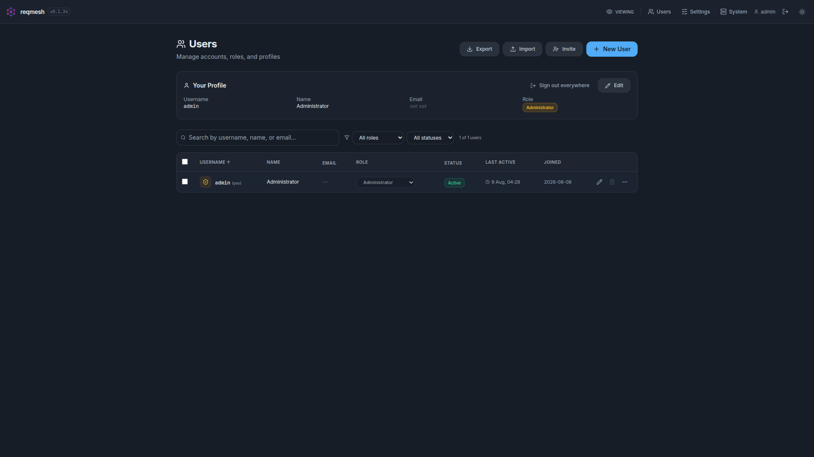

## Git Integration

If a project directory is a git repository, every mutation is auto-committed with a descriptive message (`rt: put requirements/SYST0001`). Disable with `RT_GIT_AUTOCOMMIT=false`.

- **Push to remote** — set `RT_GIT_REMOTE_URL` and `RT_GIT_PUSH_ON_COMMIT=true` to push after every auto-commit.
- **Offline mode** — `RT_OFFLINE_MODE=true` suppresses all outbound network calls (git push, SMTP).
- `GET /api/projects/{id}/git/log` — recent commits
- `POST /api/projects/{id}/hooks/install` — pre-commit hook
- `GET /api/projects/{id}/history/{item_id}` — field-level change history (works with or without git)

## Git Panel

Project settings carries a git panel that covers the whole lifecycle without a
shell on the server: initialise a repository for a project that has none, see
the current state, push on demand, install or remove the pre-commit hook, and
disconnect the remote.

The state line is the point of it. Pushes happen on a background timer and were
previously fire-and-forget — a credential expiring or a remote starting to
reject left the project silently unbacked-up while every screen looked
completely normal. Push outcomes are now recorded, and a failed last push is
the loudest thing on the panel, with the error and a **Push now** button beside
it.

Two deliberate limits. Status performs **no network access** — commits ahead are
counted against the local tracking ref, because a status call that blocks on an
unreachable remote would hang the settings page exactly when you most need it to
load. And there is no button that deletes a repository: removing `.git` would
destroy every version of every requirement irreversibly. Disconnecting the
remote is the reversible operation, and it clears both the git remote and the
stored `remote_url` so the two cannot disagree.

Changing the remote stays admin-only — it decides where the entire project
history is shipped. Credentials embedded in a remote URL are redacted
everywhere they could surface, including push error messages.

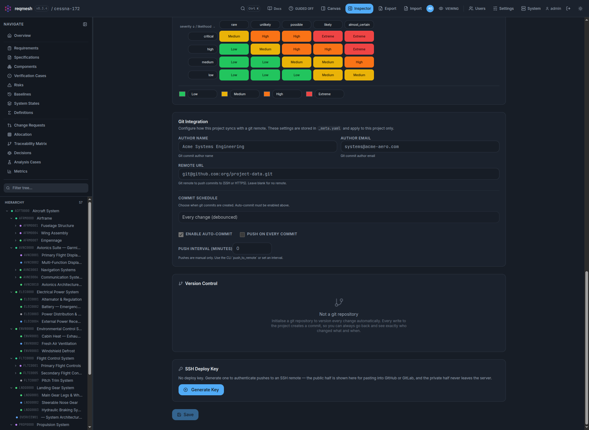

## Interchange

Requirements round-trip through **ReqIF 1.2**, **SysML v2**, **CSV**, **TSV**, and **XLSX**:

- **Export** — from the Export dialog, `POST /api/projects/{id}/publish/download?format=reqif|sysml|csv|tsv|xlsx`, or CLI `export -f reqif`.
- **Import** — from the Import dialog, `POST /api/projects/{id}/import`, or CLI `import -i <file>`. Format is auto-detected; `mode=merge` (default) creates/updates; `mode=replace` wipes existing first. CSV import supports column aliases (e.g. `"Requirement ID"` → `id`). Add `dry_run=true` (CSV, TSV and XLSX only) to preview the change — the response reports `would_create`, `would_update` and `would_delete` without writing anything.

## Project Overview

Every project opens to a dashboard that gives a high-level health snapshot:
clickable stat cards for requirements, specifications, components and
verification cases, plus distribution charts for status, quality completeness,
priority, type and verification method. It is the landing page for a project
and the quickest way to assess coverage, effort distribution and overall
progress.

The requirements tree, the graph canvas and the inspector sit side by side —
status, priority and verification state are visible per requirement without
opening anything.

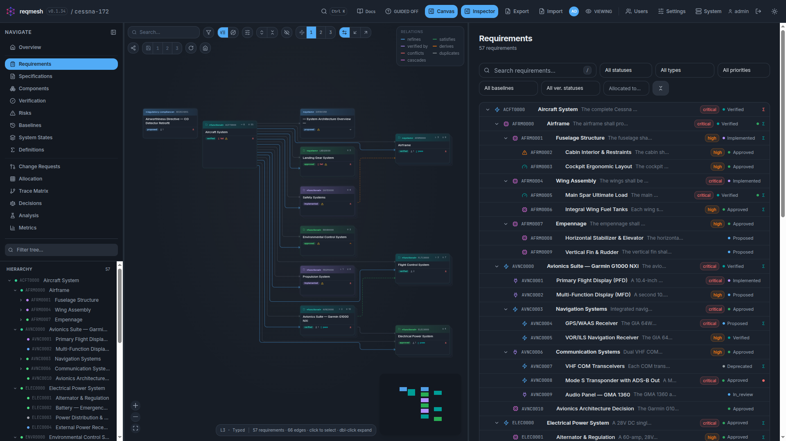

The same model as a diagram — requirements, components and their relationships,
with derivation highlighting and saved views.

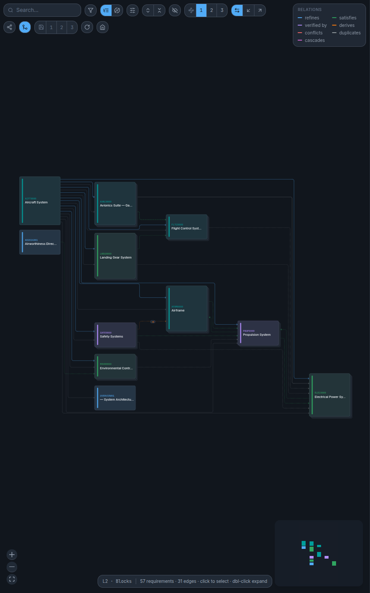

## Components (the synthesised design)

Requirements describe what the system must **do**. Components describe what the system **is** — the design synthesised to meet those requirements. They form a hierarchy (`system → subsystem → assembly → part`, plus `software` and `interface`) and connect to the functional side three ways:

- **`satisfies`** — the requirements a component exists to deliver
- **`verification_cases`** — the cases that exercise the component
- **`relations`** — links to other components in the design tree

Components carry numeric `parameters` (mass, current draw, cost…) that feed budget rollups in the parametric evaluation engine. Each parameter's value is multiplied by the component's `quantity` during rollups.

Deleting a component promotes its children to the deleted component's parent, so the tree never dangles. Reparenting detects and rejects cycles. All component mutations produce an audit trail.

## Computable Requirements (SysML-style parametrics)

Requirements can carry typed numeric **parameters** and boolean **constraints** over them, so a requirement isn't just prose — it's evaluable:

```yaml
parameters:
  - {name: mtow, value: 1157, unit: kg}
  - {name: useful_load, unit: kg, expr: "mtow - AFRM0000.empty_mass"}
constraints:
  - {expr: "useful_load >= 380", assume: "OAT >= -20"}
```

- **Bounds between requirements** — an expression can reference another requirement's parameter as `ID.param`.
- **Budget rollups** — `rollup('WING', 'mass')` sums a parameter over a component subtree, multiplying by quantity.
- **Verdicts and margins** — pass / fail / unknown / error, with signed margin (absolute + %). An `assume` clause gates applicability.
- **Measured verdicts** — verification cases record measurements against parameters; the engine substitutes measured values and reports separate "design" and "measured" verdicts.
- **Safe evaluation** — expressions are parsed against a strict whitelist; YAML content can never execute arbitrary code. Derivation chains resolve across requirements with cycle detection.

Evaluate via `GET /api/projects/{id}/evaluation`. In the UI: the **Parameters & Constraints** card on a requirement shows live verdicts and margins; components carry their parameters; verification cases record measurements; a **Parametrics Guide** (togglable via the Guided button) explains everything in plain English.

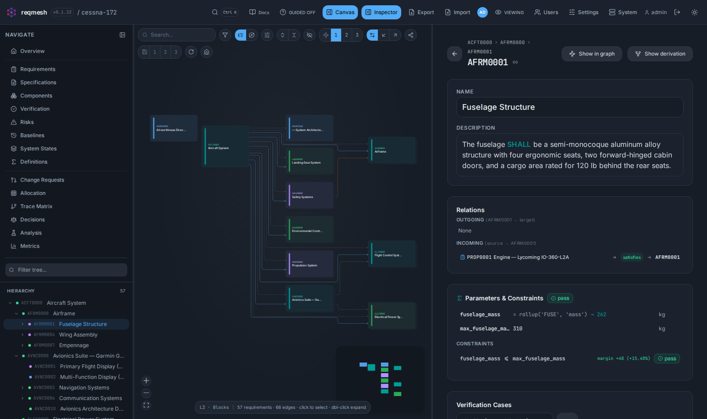

### Live what-if preview

In edit mode, each literal parameter carries a **what-if** control: enter a hypothetical value and the change is evaluated ad-hoc — without writing anything — so you can see its blast radius before committing.

- **Animated cascade** — a panel over the inspector steps through every affected parameter and constraint in dependency order, substituting values and revealing each new result and verdict; minimize it to a floating bar to stack more overrides across several requirements.
- **Live canvas** — downstream requirements whose verdict actually changes light up on the graph (red = newly broken, green = newly fixed, blue = the value you're editing) while unaffected nodes dim, and the active step pulses its node in sync with the panel.
- **Confirm or restore** — commit all overrides at once (writing real parameter values) or discard them; because nothing persists until you confirm, careful data entry can never silently break a threshold.

Powered by `POST /api/projects/{id}/evaluation/impact`, which reuses the same evaluator with hypothetical overrides and returns a dependency-ordered impact trace plus the list of requirements whose verdict changed.

## Deep Traceability & Coverage

Beyond simple binary coverage, reqmesh implements **shallow** and **deep** coverage tracing:

- **Shallow** — for each `needs` type (e.g. `["design", "test"]`), is there at least one covering item?
- **Deep** — are all coverers themselves fully covered transitively? A "broken chain" is flagged when an item is shallow-covered but its coverers are not deep-covered.
- **Terminating items** — items with empty `needs` are automatically deep-covered (leaf of the chain).
- **Cycle detection** — Tarjan's SCC algorithm detects circular relations, with depth guard (max 1000) to prevent stack overflow.
- **Code-to-requirement tags** — `POST /api/projects/{id}/scan` scans source files for `[impl->REQ-ID]` and `@covers REQ-ID` tags, linking them to requirements with SHA-based staleness detection.

See `GET /api/projects/{id}/coverage` and `/trace` (supports `?format=text` for CLI-friendly output). The CLI `trace` command produces an OFT-style plaintext report and exits non-zero on incomplete deep coverage.

Every link in the project, filterable, with orphans and suspect links surfaced
rather than hidden.

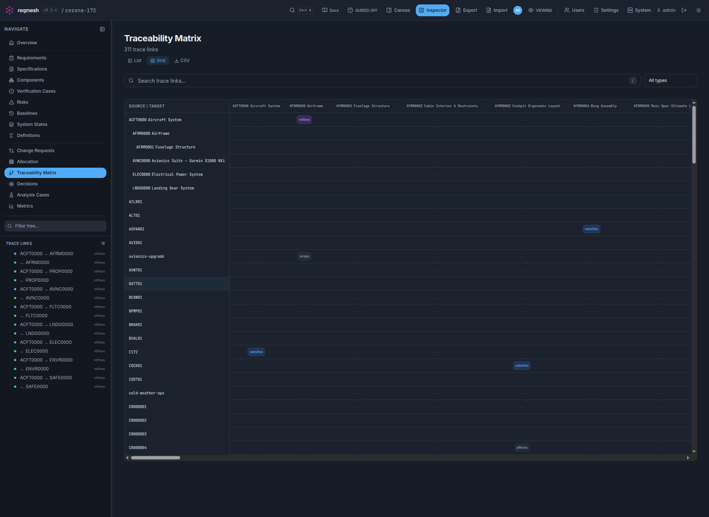

Verification cases record the test procedure, steps and measured results, and
feed those measurements back into the parametric verdicts.

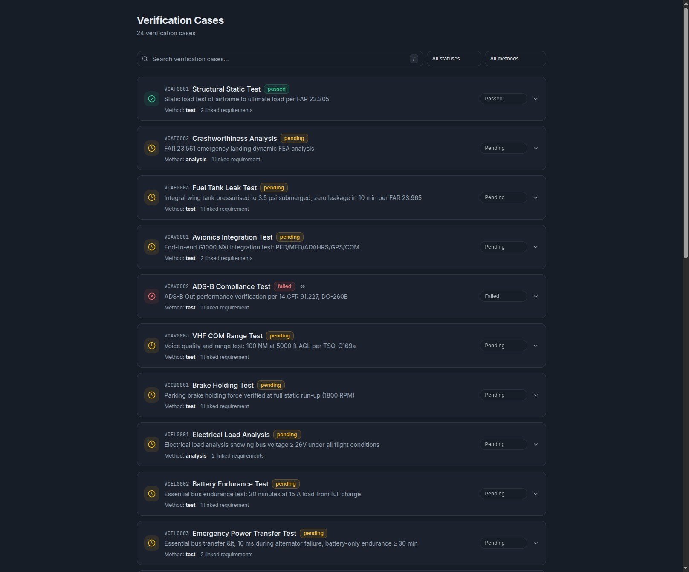

## Review & Change Control

Fingerprint-based review (inspired by Doorstop):

- **`reviewed`** — SHA-256 of normative fields. A requirement is "reviewed" when its fingerprint matches the stored baseline.
- **`reviewed_fingerprint`** on each relation — captures the target's fingerprint at review time. If the target changes, the link becomes suspect.
- **Automatic staleness** — computed on read via the integrity checker. No imperative bookkeeping, no drift.
- **`derived`** items — requirements that don't need a parent link (e.g., external regulatory mandates).
- **`normative`** flag — non-normative items are excluded from coverage and gap analysis, rendered as section headings in published output.

`POST /api/projects/{id}/requirements/{req_id}/review` baselines a single requirement. `POST /api/projects/{id}/review-all` baselines all. `GET /api/projects/{id}/unreviewed` lists items whose content has changed since review.

## Quality Linting

Inline requirement writing feedback based on INCOSE, EARS, and ISO 29148 guidelines:

- **Weak words** — "should", "may", "appropriate", "user-friendly", etc.
- **Vague quantifiers** — "several", "minimal", "a lot of"
- **Placeholders** — "TODO", "TBD", "FIXME", "???"
- **Non-atomic** — multiple conjunctions suggesting split
- **Untestable** — test-verified requirements with no measurable criteria
- **Word count** — too short (< 5 words) or too long (> 200 words)
- **HTML-aware** — strips tags and decodes entities before analysis

Configurable per project via `_meta.yaml` (`quality.rules`, `quality.weights`, `quality.min_words`, `quality.max_words`). The **Description Helper** (togglable via the Guided button) provides live client-side feedback as you type, with guideline explanations for each rule.

## Priorities & Backlog

- **`priorities`** — per-stakeholder scores (`{"development": 5, "customers": 8, "safety": 10}`)
- **Prioritized backlog** — `GET /api/projects/{id}/backlog` returns requirements ordered by combined priority scores

## Activity

The metrics page plots project activity over time: a stacked bar per day (or
week) coloured by entity kind, drawn from the audit history every write already
records. It answers "what kind of work has been happening, and when" — a burst
of risk edits before a review, a quiet fortnight, a spike of requirement churn
after a change request landed.

Counts are **distinct items touched**, not audit entries, so a bulk status
change across forty requirements registers as forty items on one day rather
than swamping the chart. The window defaults to the last 90 days and is capped
at 365; entries are skipped by filename before being parsed, so the cost tracks
the window rather than the project's whole history.

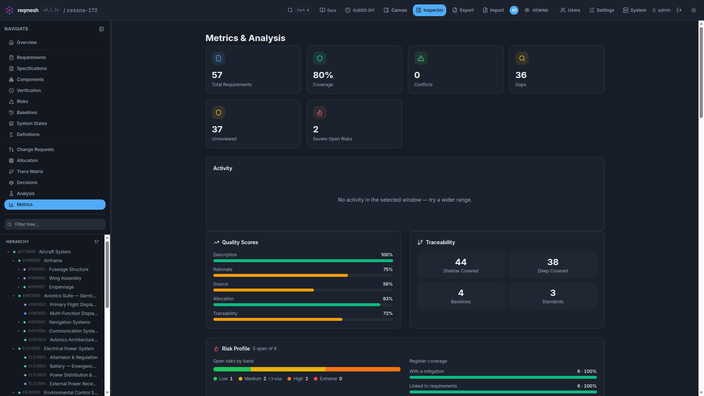

## Allocation Matrix

An interactive cross-reference grid between requirements and the entities
assigned to satisfy them — components, verification cases, risks or baselines.
Toggle which entity type sits on the columns, filter the rows, transpose the
grid, and click cells to allocate or de-allocate a requirement directly. A
summary bar tracks the count and percentage of allocated versus unallocated
rows.

On the **baselines** tab the rows themselves can be switched between
requirements and components (`rows=requirements|components`), because baseline
membership is held by the row entity rather than the column — components carry
`baselines` the same way requirements do, and this is the only way to tick them
in bulk. The other tabs reject `rows=components`: requirements are always the
rows there.

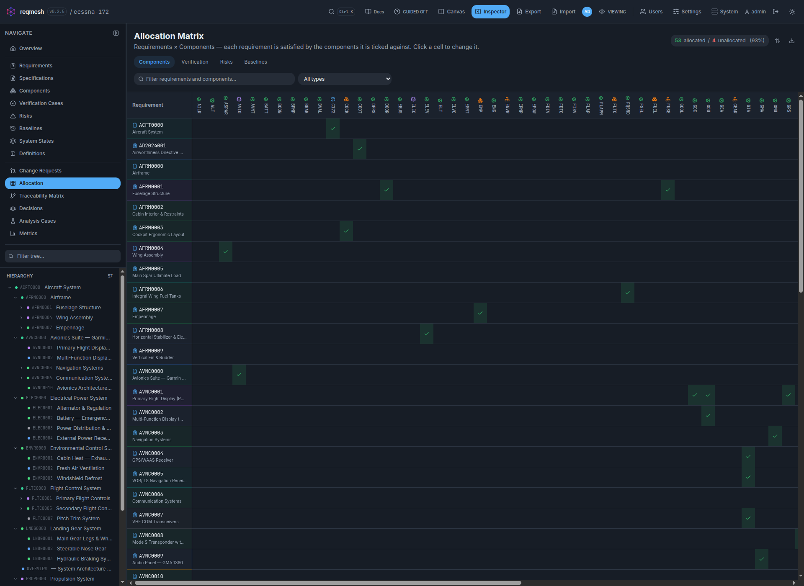

## Decisions

Architecture decision records. Each one keeps `context`, `decision`, `rationale`
and `consequences` as four separate fields rather than one blob — collapsing
them is what makes an ADR stop being an ADR — and links to the requirements it
governs and the components it settles.

`status` is a free string, not an enum. Common values are offered
(`proposed`, `accepted`, `superseded`, `deprecated`, `rejected`) but a stored
value outside that set still renders and stays selected, because the model does
not constrain it and silently rewriting it would be data loss.

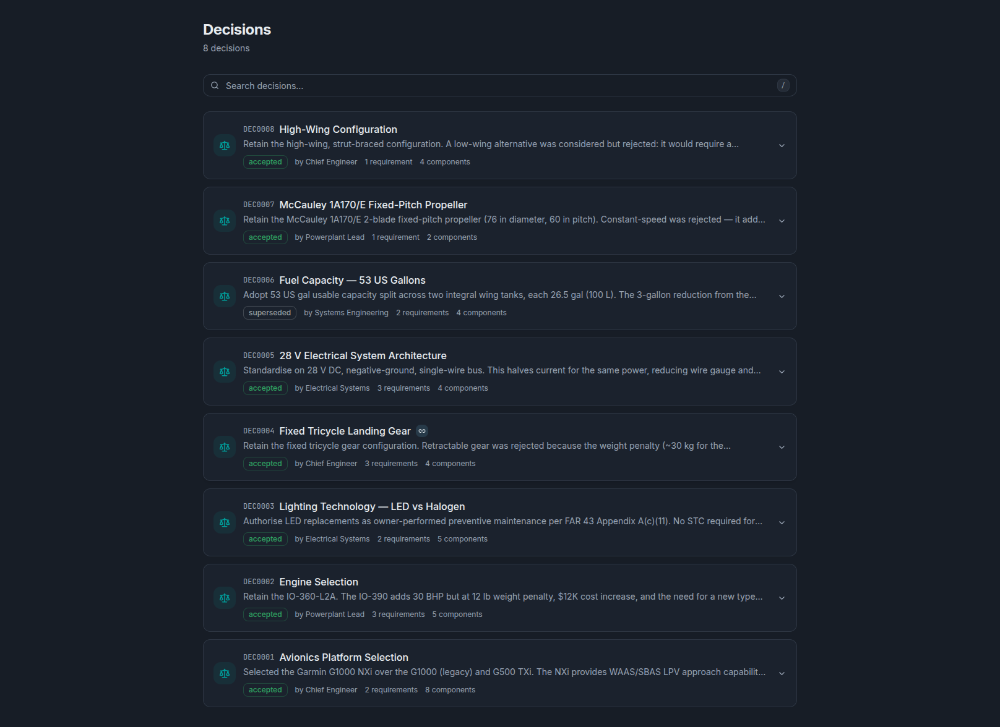

## Definitions

Reusable SysML v2-style `constraint def` and `calc def`: write a rule once over
formal parameters, then bind it by name from any requirement's `constraint_def`
or `calc_def`. The page shows what each one computes, which is the thing a
requirement binding a definition by name cannot tell you on its own.

Expressions are evaluated server-side only. There is no client-side parser,
deliberately — one that disagreed with the solver would be worse than none.

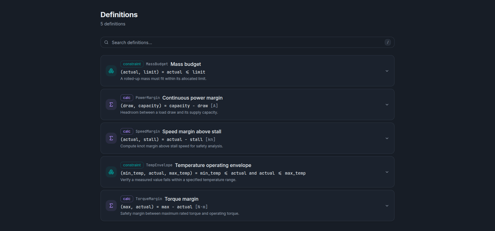

## Analysis Cases

Scoped what-if studies: a set of hypothetical parameter overrides
(`ENTITY.param = value`) plus the requirements and components in scope. Cases
are stored with the project, so a study is reviewable and reproducible rather
than a value someone typed once.

Evaluation happens from the parametrics surface, which owns the solver and the
verdict rendering; this page is where cases are written and scoped.

## Cross-linking

Every entity reference is a hyperlink to that entity, wherever it appears. Each kind carries its own colour-coded icon.

- **`@` mentions** — type `@` in any description or notes field to open a floating entity picker; keep typing to filter, `↑`/`↓` to move, `Enter` or `Tab` to insert, `Escape` to dismiss
- **Ctrl/Cmd+K command palette** — word-based fuzzy search across every entity; tolerates missing spaces (e.g. `fuelpump` matches `Fuel Pump`)
- **Hover previews** — pause on any reference to see a peek card with kind, status, and description
- **Copy link** — copies an absolute deep-link URL for commits, chat, or tickets
- **Backlinks** — relations render in both directions
- **Breadcrumbs** — ancestor chain with "Show in graph" shortcut
- **Auto-linking** — entity IDs in descriptions become links automatically in both read and edit modes

### Mentions

The picker uses the same fuzzy index as the command palette, and the `@` must
start a word — so an email address never triggers it.

What is inserted depends on the field, and both forms stay plain text so a
reference is readable in a `git diff` and survives export:

| Field | Stored as | While editing |
|---|---|---|
| Rich text — requirement, component, risk, baseline descriptions | `[[ID]]` | an inline chip with the entity's icon |
| Plain text — decision records, verification procedures | the bare id | plain text (a `textarea` can only hold text) |

Rich-text descriptions are sanitised server-side against a tag allowlist that
does not include `<span>`, so the bracket token — not the editor's markup — is
what actually persists. Both forms render on read as a link carrying the entity
kind's icon, with the brackets consumed.

A reference whose entity is later deleted renders as plain text rather than a
broken link, so nothing silently vanishes from your prose.

## Selecting & Bulk Editing

Lists with checkboxes — requirements, components, specifications, risks and
change requests — support range selection:

| Gesture | Effect |
|---|---|
| Click | Tick or untick one row; other selections are kept |
| `Ctrl`/`Cmd` + click | Same as a plain click |
| `Shift` + click | Apply that row's new state across the range from the last row clicked |

Plain click stays a toggle rather than replacing the selection, because these
are checkboxes — clicking a ticked box to silently clear everything else is not
what a checkbox promises. A Shift range spans the rows **as displayed**, so
filtering or collapsing a branch changes what it covers, and because the clicked
row decides the range's state, Shift+click clears a block as readily as it
selects one.

## Guided Mode (Helpers)

A `GUIDED` toggle in the header bar switches on contextual help across the application:

- **Section descriptions** — small italic text explaining what each UI section does
- **Parametrics Guide** — expandable Q&A covering parameters, budget rollups, constraints, measured verdicts, and expression language — no SysML knowledge required
- **Description Helper** — live inline feedback on requirement writing quality with expandable guideline reference

## Real-time Collaboration

Every project exposes an SSE stream at `GET /api/projects/{id}/events`. The web UI subscribes automatically:

- **Live updates** — lists, the navigation tree, and the graph refresh the moment anyone mutates the project.
- **Presence** — the header shows who is currently viewing the project; `GET /api/projects/{id}/presence` returns the roster as JSON.

User identity is extracted from the JWT token (not from query parameters). The event bus is in-memory (single process); clients auto-reconnect if the stream drops.

## Deployment

For production deployment on a local server with **TLS**, **multiple concurrent users**, **email notifications**, **git push to remote**, and **air-gapped offline mode**, see **[DEPLOYMENT.md](DEPLOYMENT.md)**.

Quick start — the installer handles Docker or bare-metal, the reverse proxy,
TLS, secrets and the systemd unit:

```bash
curl -fsSL https://raw.githubusercontent.com/CallumNunesVaz/reqmesh/v0.1.36/scripts/install.sh | bash
```

It walks through deployment mode, proxy, TLS and credentials, then deploys. For
CI or a scripted rollout, drive it with environment variables instead:

```bash
curl -fsSL https://raw.githubusercontent.com/CallumNunesVaz/reqmesh/v0.1.36/scripts/install.sh \
  | REQMESH_PROXY=caddy REQMESH_TLS=selfsigned bash -s -- --non-interactive
```

The admin password is written to `/opt/reqmesh/.initial-admin` (mode 0600), not
printed — installers get piped into logs. Log in, change it, delete the file.

**To upgrade**, `sudo ./install.sh --upgrade` — newest release, nothing else
touched. It refuses rather than proceed if there is no existing install, or if a
configuration variable is set that would change the deployment.

A plain re-run also upgrades in place. Settings, the signing secret and existing
accounts are kept; anything you set explicitly for that run wins. The admin
password is *not* regenerated, because the application only seeds an admin when
there is no account yet.

Useful flags: `--debug` traces every command (the transcript then contains
secrets, and is written 0600), `--no-log` disables the transcript. On failure
the installer prints the transcript path.

Raw `docker compose` still works if you prefer to wire it up yourself:

```bash
export RT_SECRET=$(openssl rand -hex 32)
export RT_ADMIN_PASSWORD=$(openssl rand -base64 16)
docker compose -f docker-compose.prod.yml up -d
```

Key environment variables:

| Variable | Default | Description |
|----------|---------|-------------|
| `RT_PROFILE` | `team` | Security posture: `personal`, `team`, or `hardened` |
| `RT_REQUIRE_AUTH` | (per profile) | Require a session for every API route |
| `RT_COOKIE_SECURE` | (per profile) | `Secure` flag on the session cookie — set `false` for plain HTTP |
| `RT_ALLOW_SELF_REGISTRATION` | (per profile) | Let users create their own accounts |
| `RT_ALLOWED_HOSTS` | `["*"]` | Reject requests whose `Host` header doesn't match |
| `RT_SECRET` | (generated) | JWT signing key |
| `RT_ADMIN_PASSWORD` | (generated) | Initial admin password |
| `RT_DATA_ROOT` | `~/.reqmesh/projects` | Project storage directory |
| `RT_GIT_AUTOCOMMIT` | `true` | Auto-commit changes |
| `RT_GIT_REMOTE_URL` | `""` | Remote to push commits to |
| `RT_GIT_PUSH_ON_COMMIT` | `false` | Push after each auto-commit |
| `RT_OFFLINE_MODE` | `false` | Suppress all outbound network calls |
| `RT_SMTP_HOST` | `""` | SMTP server (empty disables email) |
| `RT_BASE_URL` | `http://localhost:8000` | Public URL for email links |
| `RT_SEED_DEMO` | `true` | Seed Cessna example on first launch |
| `RT_LOG_LEVEL` | `INFO` | Python log level |
| `RT_DEBUG` | `false` | Show stack traces in errors |

## API

### Core CRUD

| Method | Endpoint | Description |
|--------|----------|-------------|
| GET/POST | `/api/projects` | List/create projects |
| GET/PATCH/DELETE | `/api/projects/{id}` | Get/update settings/delete project |
| GET | `/api/projects/{id}/workflow` | Workflow status-transition config |
| GET/POST | `/api/projects/{id}/requirements` | List/search or create |
| GET/PUT/DELETE | `/api/projects/{id}/requirements/{req_id}` | Get/update/delete requirement |
| GET | `/api/projects/{id}/requirements/tree` | Requirement hierarchy |
| GET | `/api/projects/{id}/requirements/next-uid` | Next free UID |
| POST | `/api/projects/{id}/requirements/{req_id}/rename` | Rename a requirement, repointing children and relations (omit `new_id` to just get a suggestion) |
| POST | `/api/projects/{id}/requirements/{req_id}/cascade` | Cascade to children |
| POST | `/api/projects/{id}/requirements/{req_id}/break-cascade` | Break cascade link |
| GET/POST | `/api/projects/{id}/specifications` | List/create specifications |
| GET/PUT/DELETE | `/api/projects/{id}/specifications/{spec_id}` | Get/update/delete specification |
| GET/POST | `/api/projects/{id}/components` | List/create components |
| GET/PUT/DELETE | `/api/projects/{id}/components/{component_id}` | Get/update/delete component |
| GET | `/api/projects/{id}/components/tree` | Component hierarchy |
| GET | `/api/projects/{id}/components/export/bom` | Bill of materials export |
| GET/POST | `/api/projects/{id}/verification` | List/create verification cases |
| GET/PUT/DELETE | `/api/projects/{id}/verification/{vc_id}` | Get/update/delete verification case |
| POST | `/api/projects/{id}/verification/{vc_id}/run` | Record a test execution |
| GET/POST | `/api/projects/{id}/baselines` | List/create baselines |
| PATCH/DELETE | `/api/projects/{id}/baselines/{name}` | Rename/delete baseline |
| PUT | `/api/projects/{id}/baselines/order` | Rewrite the baseline sequence |
| GET/POST | `/api/projects/{id}/system-states` | List (including orphans)/create system states |
| PATCH/DELETE | `/api/projects/{id}/system-states/{name}` | Rename/delete system state (rename cascades) |
| GET/POST | `/api/projects/{id}/definitions` | List/create SysML constraint/calc definitions |
| PUT/DELETE | `/api/projects/{id}/definitions/{def_id}` | Update/delete definition |
| GET/POST | `/api/projects/{id}/analysis` | List/create analysis cases |
| PUT/DELETE | `/api/projects/{id}/analysis/{case_id}` | Update/delete analysis case |
| GET | `/api/projects/{id}/analysis/{case_id}/run` | Run an analysis case |
| GET/PUT | `/api/projects/{id}/traces` | Get/update the trace matrix |
| GET | `/api/projects/{id}/trace-model` | Every declared relationship in the project |

### Change Control

| Method | Endpoint | Description |
|--------|----------|-------------|
| GET/POST | `/api/projects/{id}/change-requests` | List/create change requests |
| PUT/DELETE | `/api/projects/{id}/change-requests/{cr_id}` | Update/delete change request |
| GET | `/api/projects/{id}/change-requests/{cr_id}/redline` | Before/after per affected target |
| POST | `/api/projects/{id}/change-requests/{cr_id}/execute` | Apply a change request |
| POST | `/api/projects/{id}/change-requests/{cr_id}/reject` | Reject a change request |
| GET/POST | `/api/projects/{id}/comments` | List/create comments |
| PATCH/DELETE | `/api/projects/{id}/comments/{comment_id}` | Resolve/delete comment |
| GET/POST | `/api/projects/{id}/decisions` | List/create decision records |
| PUT/DELETE | `/api/projects/{id}/decisions/{dec_id}` | Update/delete decision |
| POST | `/api/projects/{id}/requirements/{req_id}/review` | Fingerprint baseline a requirement |
| POST | `/api/projects/{id}/review-all` | Baseline all requirements |
| GET | `/api/projects/{id}/unreviewed` | Requirements whose content changed since review |
| GET | `/api/projects/{id}/requirements/{req_id}/fingerprint` | Current review fingerprint |
| POST | `/api/projects/{id}/scan` | Scan source files for `[impl->REQ-ID]` coverage tags |
| GET | `/api/projects/{id}/references/freshness` | Stale reference file detection |

### Risks

| Method | Endpoint | Description |
|--------|----------|-------------|
| GET/POST | `/api/projects/{id}/risks` | List/create risks |
| PUT/DELETE | `/api/projects/{id}/risks/{risk_id}` | Update/delete risk |
| GET | `/api/projects/{id}/risk-matrix` | Project risk matrix (severity × likelihood) |
| GET | `/api/projects/{id}/risk-bingo` | Severity × likelihood grid of risk counts |

### Analysis & Validation

| Method | Endpoint | Description |
|--------|----------|-------------|
| GET | `/api/projects/{id}/validate` | Integrity checks (dangling links, cycles, unreviewed, cascades…) |
| GET | `/api/projects/{id}/coverage` | Shallow + deep coverage analysis |
| GET | `/api/projects/{id}/trace` | Coverage trace (`?format=text` for plaintext) |
| GET | `/api/projects/{id}/metrics` | Quality, traceability, status distribution |
| GET | `/api/projects/{id}/gap-analysis` | Missing descriptions, rationales, sources, links |
| GET | `/api/projects/{id}/conflicts` | Explicit conflicts + duplicate names |
| GET | `/api/projects/{id}/compliance` | Compliance status across standards |
| GET | `/api/projects/{id}/quality` | Per-requirement quality scores and findings |
| GET | `/api/projects/{id}/pugh` | Pugh matrix over the best-valued requirements |
| GET | `/api/projects/{id}/backlog` | Prioritized backlog |
| GET | `/api/projects/{id}/evaluation` | Parametric constraint evaluation (design + measured) |
| POST | `/api/projects/{id}/evaluation/impact` | What-if preview: re-evaluate with hypothetical overrides + dependency-ordered impact trace |
| GET | `/api/projects/{id}/requirements/{rid}/impact` | Impact analysis (dependents + cascades) |
| GET | `/api/projects/{id}/history/{item_id}` | Field-level change history for any entity |
| GET | `/api/projects/{id}/activity` | Audit activity bucketed by date and entity kind (`since`, `until`, `bucket=day\|week`) |
| GET | `/api/projects/{id}/suspect-links` | Links whose target changed since review |
| GET | `/api/projects/{id}/search` | Full-text search across all entities |

### Publishing & Interchange

| Method | Endpoint | Description |
|--------|----------|-------------|
| POST | `/api/projects/{id}/publish` | Generate report (html, md, latex, pdf, csv, tsv, xlsx) |
| GET | `/api/projects/{id}/publish/download` | Download report or export file |
| POST | `/api/projects/{id}/import` | Import ReqIF, SysML, CSV, TSV, or XLSX (`mode=merge/replace`, `dry_run=true` to preview) |
| POST | `/api/projects/{id}/baselines/{name}/freeze` | Freeze a baseline snapshot |
| GET | `/api/projects/{id}/baselines/{name}/diff` | Diff current state against baseline |

### Real-time, Git & Auth

| Method | Endpoint | Description |
|--------|----------|-------------|
| GET | `/api/projects/{id}/events` | SSE stream of live changes + presence |
| GET | `/api/projects/{id}/presence` | Current project viewers |
| GET | `/api/projects/{id}/git/log` | Recent commits |
| POST | `/api/projects/{id}/git/test-remote` | Test connectivity to the configured remote |
| GET | `/api/projects/{id}/git/status` | Repository state — branch, dirty, commits ahead, last push outcome (no network access) |
| POST | `/api/projects/{id}/git/init` | Initialise a repository for a project that has none |
| POST | `/api/projects/{id}/git/push` | Push now, returning the real outcome |
| DELETE | `/api/projects/{id}/git/remote` | Disconnect the remote (admin only) |
| POST | `/api/projects/{id}/hooks/install` | Install the pre-commit hook (validates requirements before a commit) |
| POST | `/api/projects/{id}/hooks/uninstall` | Remove the pre-commit hook |
| POST | `/auth/login` | Authenticate (rate-limited 5/min) |
| POST | `/auth/register` | Self-registration |
| POST | `/auth/forgot-password` | Request password reset email |
| POST | `/auth/reset-password` | Reset password with token |
| POST | `/auth/verify-email` | Verify email address |
| POST | `/auth/resend-verification` | Re-send verification email |

### System (admin)

| Method | Endpoint | Description |
|--------|----------|-------------|
| GET | `/api/system/demo-project` | Whether the bundled example is loaded, and how many requirements re-seeding would replace |
| POST | `/api/system/demo-project/reseed` | Re-seed the bundled example. 409 unless `force` is sent once the project exists — re-seeding deletes it, git history included |

PUT/PATCH endpoints apply partial updates: only fields present in the body change, and explicitly sending `null` clears a nullable field. PATCH on `/comments` supports `{"resolved": true}`. List endpoints return `{"items": [...], "total": N, "offset": O, "limit": L}` for pagination.

## Project Data Format

Each project is a directory of YAML files — one file per entity. JSON Schemas for every format are in [`schemas/`](schemas/) (regenerate with `python backend/gen_schemas.py`).

### Example Requirement YAML

```yaml
id: REQ-001
type: functional
name: "User Authentication"
description: "<p>The system shall authenticate users via OAuth2 within 500 ms.</p>"
priority: high
status: approved
verification_method: test
rationale: "OAuth2 is the industry standard for delegated authentication."
source: "ISO 27001"
allocated_to: "auth-module"
attributes:
  - {key: author, value: alice}
  - {key: standard, value: DO-178C}
relations:
  - {type: verified_by, target: VC-001, reviewed_fingerprint: "abc123…"}
verification_cases: [VC-001]
verification_status: pending
parent: FEAT-001
needs: [design, verification_case]
priorities: {development: 5, customers: 8, safety: 10}
derived: false
normative: true
reviewed: "xyz789…"
references:
  - {path: "src/auth/login.py", kind: impl, sha256: "9f2c…", lines: "L20-L45"}
parameters:
  - {name: max_response_time, value: 500, unit: ms}
constraints:
  - {expr: "max_response_time <= 500", assume: "load <= 1000"}
created: "2026-07-08T12:00:00Z"
modified: "2026-07-08T14:30:00Z"
```

## CLI

```bash
cd backend
.venv/bin/python -m app.cli create my-project
.venv/bin/python -m app.cli validate <path>              # integrity checks
.venv/bin/python -m app.cli validate <path> --quality    # + requirement quality linting
.venv/bin/python -m app.cli publish <path> -f pdf
.venv/bin/python -m app.cli export <path> -f reqif       # or -f sysml
.venv/bin/python -m app.cli import <path> -i model.reqif
.venv/bin/python -m app.cli review <path>                # fingerprint all
.venv/bin/python -m app.cli review <path> --item REQ-001
.venv/bin/python -m app.cli scan <path> --code ../src    # scan for coverage tags
.venv/bin/python -m app.cli trace <path>                 # coverage report (exits non-zero on gaps)
.venv/bin/python -m app.cli serve <path>
```

## Acknowledgements

reqmesh stands entirely on open source, and is only possible because of the
people who build and maintain these projects in the open. Thank you.

**Backend** — [FastAPI](https://fastapi.tiangolo.com/),
[Starlette](https://www.starlette.io/) and [Uvicorn](https://www.uvicorn.org/)
for the web stack; [Pydantic](https://docs.pydantic.dev/) and pydantic-settings
for the data model and configuration; [ruamel.yaml](https://yaml.readthedocs.io/)
for the round-trip YAML that makes the storage git-native;
[PyJWT](https://pyjwt.readthedocs.io/) and [bcrypt](https://github.com/pyca/bcrypt)
for authentication; [WeasyPrint](https://weasyprint.org/) and
[Jinja2](https://jinja.palletsprojects.com/) for report rendering;
[openpyxl](https://openpyxl.readthedocs.io/) for spreadsheet export;
[Click](https://click.palletsprojects.com/), python-multipart and slowapi.

**Frontend** — [React](https://react.dev/) and
[React Router](https://reactrouter.com/); [Vite](https://vitejs.dev/) and
[TypeScript](https://www.typescriptlang.org/) for the build;
[Tailwind CSS](https://tailwindcss.com/) for styling;
[Zustand](https://github.com/pmndrs/zustand) for state;
[React Flow / @xyflow](https://reactflow.dev/) with
[elkjs](https://github.com/kieler/elkjs) and
[d3-force](https://github.com/d3/d3-force) for the graph canvas;
[TipTap](https://tiptap.dev/) (on [ProseMirror](https://prosemirror.net/)) for
rich text; [Recharts](https://recharts.org/) for metrics;
[Framer Motion](https://www.framer.com/motion/) for animation;
[Lucide](https://lucide.dev/) for icons; and the
[Inter](https://rsms.me/inter/) and
[JetBrains Mono](https://www.jetbrains.com/lp/mono/) typefaces.

**Tooling & tests** — [Playwright](https://playwright.dev/),
[Vitest](https://vitest.dev/), [pytest](https://pytest.org/),
[Ruff](https://docs.astral.sh/ruff/), [oxlint](https://oxc.rs/),
[PostCSS](https://postcss.org/) and [Docker](https://www.docker.com/). PDF
reports can use the [Tectonic](https://tectonic-typesetting.github.io/) LaTeX
engine.

Bundled/adjacent third-party software and its licensing is listed in
[THIRD_PARTY_NOTICES.md](THIRD_PARTY_NOTICES.md).

## License

reqmesh is licensed under the **GNU General Public License v3.0 or later**
(GPL-3.0-or-later) — see [LICENSE](LICENSE). GPLv3 is required for compatibility
with the project's dependencies: elkjs is offered under `GPL-3.0-or-later`, and
the Apache-2.0 components (bcrypt, python-multipart) are GPLv3-compatible but not
GPLv2-compatible.

Bundled/adjacent third-party software (e.g. the tectonic LaTeX engine) is listed
in [THIRD_PARTY_NOTICES.md](THIRD_PARTY_NOTICES.md).
